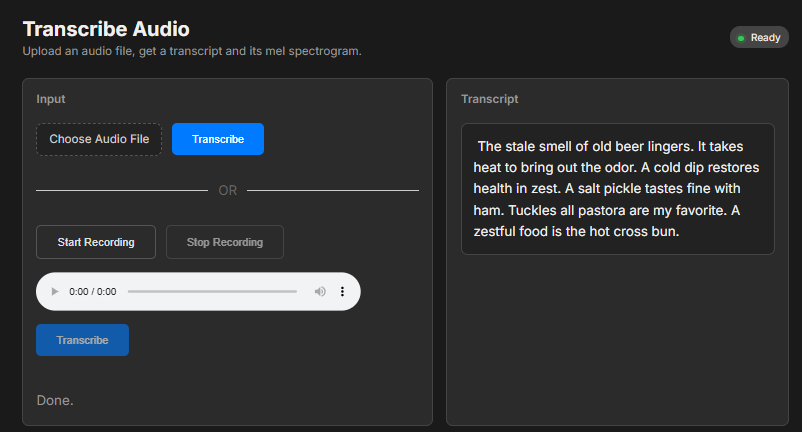
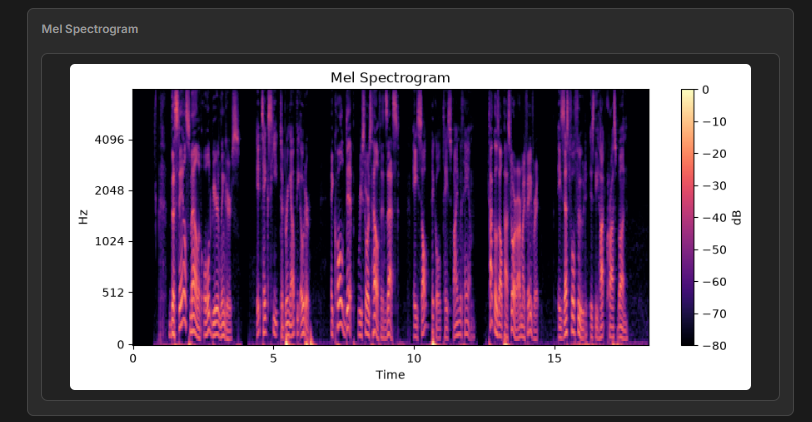
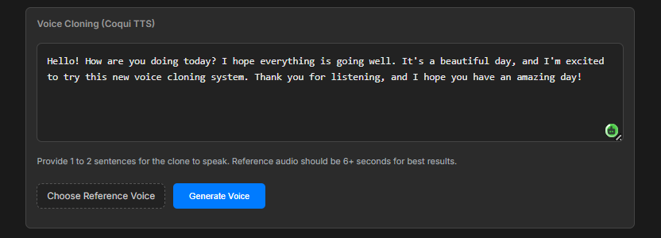

# 🎧 Voice Cloning & Audio Transcription Suite (FastAPI + Whisper)

A modern, responsive, and high-performance web application combining state-of-the-art speech-to-text (Whisper) and text-to-speech/voice-cloning capabilities into a single interface.

<p align="center">
  
  
  
  
</p>


## ✨ Features & Interface

Our suite is divided into three primary features, complete with real-time visualization and responsive UI controls.

### 1. 🎙️ Voice Transcribe
Transcribe pre-recorded audio files or capture your voice live using the in-browser high-fidelity microphone recorder. Powered by OpenAI's Whisper model, it delivers fast and accurate speech-to-text conversion.
<p align="center">
  
</p>

### 2. 📊 Mel Spectrogram Generation
Analyze audio frequency components visually. The application generates a professional, high-resolution Mel Spectrogram (using logarithmic decibel scaling) right after transcription.
<p align="center">
  
</p>

### 3. 👥 Voice Cloning & TTS Synthesis
Synthesize custom text using any target voice reference. By uploading a brief reference audio file, the backend voice-cloning engine duplicates style, tone, and timbre to produce a synthesized audio file ready for instant playback.
<p align="center">
  
</p>


## 🧰 Tech Stack

- **Backend:** FastAPI, Uvicorn, OpenAI Whisper, ChatterboxTTS, RealtimeTTS, Librosa, NumPy, Matplotlib, PyTorch, torchaudio
- **Frontend:** HTML5, CSS3 (Modern premium styling), Vanilla JavaScript (microphone recording, playback, API handling)

---

## 📁 Project Structure

```text
.
├── main.py                 # FastAPI application & API endpoints
├── requirements.txt        # Backend dependencies & package list
├── static/                 # Web assets directory
│   ├── index.html          # Clean & interactive frontend interface
│   ├── style.css           # Premium dark mode styling & layout
│   └── app.js              # Client-side audio processing & API requests
└── README.md               # Project documentation
```

---

## 🧩 Prerequisites

1. **Python 3.9+** is highly recommended.
2. **ffmpeg** installed and configured in your system `PATH` (critical for audio decoding and Whisper processing):
   - **Windows:** Run `choco install ffmpeg` or download from [ffmpeg.org](https://ffmpeg.org).
   - **macOS:** Run `brew install ffmpeg`.
   - **Linux:** Run `sudo apt-get install ffmpeg`.

---

## 🚀 Setup & Installation

### 1. Environment Configuration
Create and activate a Python virtual environment:
```bash
python -m venv venv
# On Windows:
.\venv\Scripts\activate
# On macOS/Linux:
source venv/bin/activate
```

### 2. Install Dependencies
Install all backend dependencies:
```bash
pip install -r requirements.txt
```

> [!NOTE]
> PyTorch and torchaudio are required by Whisper and Chatterbox TTS. If you plan to run neural models with GPU acceleration, install the appropriate CUDA PyTorch build according to instructions on [pytorch.org](https://pytorch.org/get-started/locally/).

---

## 🏃 Running the Application

Start the FastAPI server:
```bash
uvicorn main:app --reload
```

Access the application in your browser at:
👉 **[http://127.0.0.1:8000](http://127.0.0.1:8000)**

---

## 🔌 API Documentation

### 1. Transcribe Audio
- **Endpoint:** `POST /transcribe`
- **Content-Type:** `multipart/form-data`
- **Parameters:** 
  - `file`: Audio file binary (Required)
- **Response (200 OK):**
  ```json
  {
    "transcription": "Extracted speech text here...",
    "mel_spectrogram": "data:image/png;base64,..."
  }
  ```

### 2. Clone Voice / Speech Synthesis
- **Endpoint:** `POST /clone-voice`
- **Content-Type:** `multipart/form-data`
- **Parameters:**
  - `text`: Text prompt to synthesize (Form field, Required)
  - `ref_voice`: Audio file containing target voice (File field, Required)
- **Response (200 OK):**
  ```json
  {
    "audio": "data:audio/wav;base64,..."
  }
  ```

---

## 🛠️ Troubleshooting

- **Whisper/Torch Errors:** Verify your PyTorch installation. If running on a system without a GPU, enforce CPU configurations or download PyTorch CPU wheels.
- **ffmpeg Warnings:** Ensure `ffmpeg` is globally executable. Try typing `ffmpeg -version` in a terminal window.
- **RealtimeTTS fails on Linux:** Install the PortAudio development headers before installing PyAudio/RealtimeTTS:
  ```bash
  sudo apt-get update && sudo apt-get install python3-dev portaudio19-dev
  ```

---

Made with 💖 by **Rishabh Dhawad**.